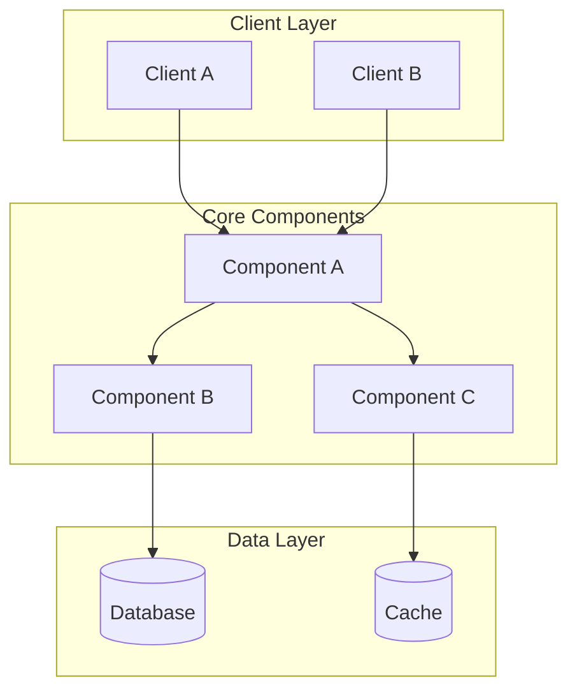
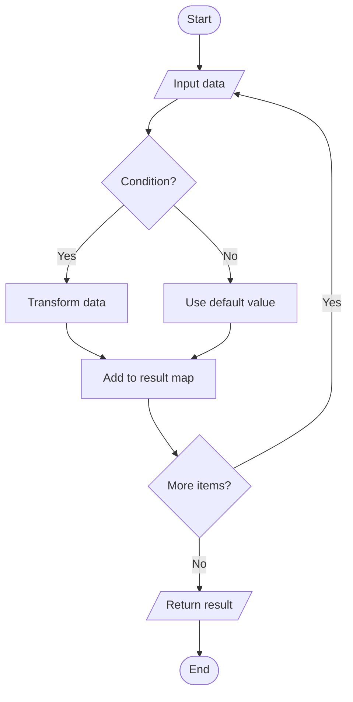
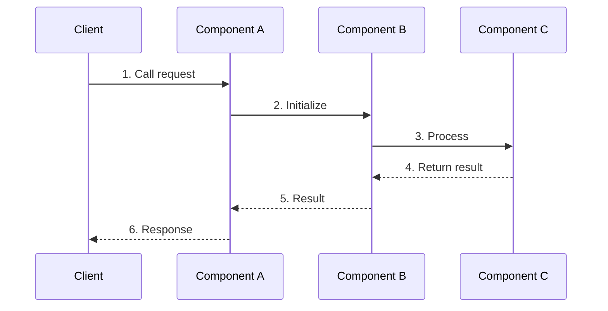

# Design Specification Template

> **Perspective**: Technical | **Audience**: Developers, Architects
>
> This document describes technical implementation, **including architecture design, pseudocode, and algorithm description**.

---

## 1. Overview

Brief description of design scheme core content

---

## 2. Architecture Design

### 2.1 Overall Architecture Diagram



### 2.2 Component Responsibilities

| Component | Responsibility | Key Capabilities |
|-----------|----------------|------------------|
| Component A | Responsibility description | Capability 1, Capability 2 |
| Component B | Responsibility description | Capability 1, Capability 2 |

---

## 3. Core Component Design

### 3.1 Component A Design

#### 3.1.1 Data Structure

```go
// Data structure description
type ComponentA struct {
    Field1 string    // Field description
    Field2 int       // Field description
    Field3 []string  // Field description
}
```

#### 3.1.2 Core Method Signatures

| Method | Signature | Description |
|--------|-----------|-------------|
| Method1 | `func (c *ComponentA) Method1(param string) error` | Method description |
| Method2 | `func (c *ComponentA) Method2() (Result, error)` | Method description |

#### 3.1.3 Core Algorithm Flowchart



#### 3.1.4 Sequence Diagram



### 3.2 Component B Design
(Same structure)

---

## 4. Configuration Data Structure Design

### 4.1 Configuration Items

| Config Item | Type | Default | Description |
|-------------|------|---------|-------------|
| config1 | string | "" | Config description |
| config2 | int | 0 | Config description |
| config3 | bool | false | Config description |

### 4.2 Configuration Example

```yaml
# Configuration file example
feature:
  enabled: true
  option1: value1
  option2: value2
```

---

## 5. Key Design Decisions

### 5.1 Decision 1: {Decision Name}

**Problem**: Describe the problem faced in design

**Options**:
- Option A: Description and pros/cons
- Option B: Description and pros/cons

**Decision**: Choose {Option X}

**Rationale**:
- Rationale 1
- Rationale 2

### 5.2 Decision 2: {Decision Name}
(Same structure)

---

## 6. Compatibility Design

### 6.1 Backward Compatibility
Describe how to maintain backward compatibility

### 6.2 Data Migration
Describe data migration plan (if any)

---

## 7. Risk Assessment

| Risk | Impact | Mitigation |
|------|--------|------------|
| Risk 1 | Impact description | Mitigation measures |
| Risk 2 | Impact description | Mitigation measures |

---

## 8. Testing Strategy

### 8.1 Unit Testing
Describe unit testing strategy

### 8.2 Integration Testing
Describe integration testing strategy

### 8.3 Test Cases

| Test Case | Input | Expected Output |
|-----------|-------|-----------------|
| TC-01 | Input description | Output description |
| TC-02 | Input description | Output description |

---

## 9. References

- [Requirements Analysis](./{feature-name}-requirements-analysis.md)
- [Implementation Plan](./{feature-name}-implementation-plan.md)
