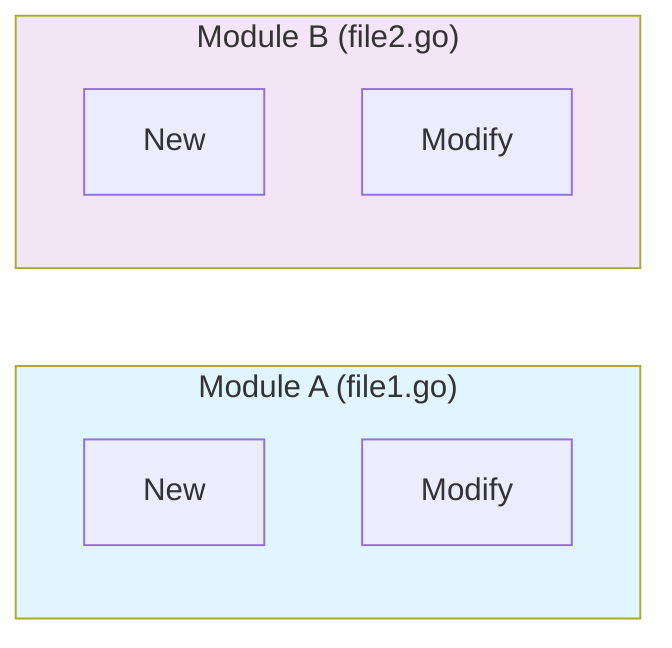
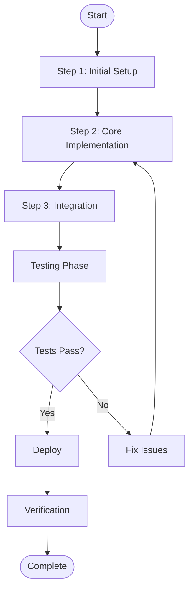
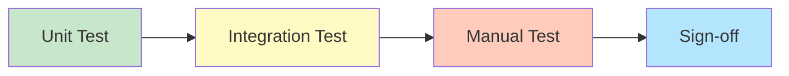

# Implementation Plan Template

> **Perspective**: Implementation | **Audience**: Developers
>
> This document describes specific implementation steps and verification plans.

---

## 1. Overview

Brief description of scope and timeline

---

## 2. Scope

### 2.1 Modules Involved

| Module | File | Change Type |
|--------|------|-------------|
| Module A | file1.go | New/Modify |
| Module B | file2.go | New/Modify |

### 2.2 Change Statistics

| Type | Count | Description |
|------|-------|-------------|
| New files | N | - |
| Modified files | N | - |
| Deleted files | N | - |

### 2.3 Scope Overview



---

## 3. Implementation Steps

### 3.1 Step 1: {Step Name}

**Goal**: What this step achieves

**Preconditions**:
- Condition 1
- Condition 2

**Steps**:

#### 3.1.1 Sub-step 1.1
```bash
# Execute command or operation
command --option value
```

#### 3.1.2 Sub-step 1.2
(Operation description)

**Verification**:
- Verification point 1
- Verification point 2

### 3.2 Step 2: {Step Name}
(Same structure)

### 3.3 Implementation Flow



---

## 4. Verification Plan

### 4.1 Unit Test Verification

| Test Case | Description | Expected Result |
|-----------|-------------|-----------------|
| TestCase1 | Verification content | Expected result |
| TestCase2 | Verification content | Expected result |

### 4.2 Integration Test Verification

| Test Scenario | Steps | Expected Result |
|---------------|-------|-----------------|
| Scenario 1 | Step description | Result description |
| Scenario 2 | Step description | Result description |

### 4.3 Manual Verification

| Verification Item | Method | Criteria |
|-------------------|--------|----------|
| Item 1 | Method description | Criteria description |
| Item 2 | Method description | Criteria description |

### 4.4 Verification Flow



---

## 5. Implementation Checklist

### 5.1 Code Check

- [ ] Code passes lint check
- [ ] Code has necessary comments
- [ ] Sensitive information handled correctly

### 5.2 Test Check

- [ ] Unit tests cover new functionality
- [ ] Integration tests pass
- [ ] Performance tests meet requirements (if applicable)

### 5.3 Documentation Check

- [ ] Requirements analysis document updated
- [ ] Design specification document updated
- [ ] Code comments improved

### 5.4 Deployment Check

- [ ] Configuration files prepared
- [ ] Deployment scripts tested
- [ ] Rollback plan prepared

---

## 6. Rollback Plan

### 6.1 Rollback Trigger Conditions
Describe conditions that trigger rollback

### 6.2 Rollback Steps

1. Step 1
2. Step 2
3. Step 3

### 6.3 Rollback Verification
Describe how to verify successful rollback

---

## 7. Risks and Mitigation

| Risk | Probability | Impact | Mitigation |
|------|-------------|--------|------------|
| Risk 1 | Low/Medium/High | Low/Medium/High | Mitigation measures |
| Risk 2 | Low/Medium/High | Low/Medium/High | Mitigation measures |

---

## 8. Implementation Progress

| Phase | Planned Time | Actual Time | Status |
|-------|-------------|-------------|--------|
| Phase 1 | - | - | Pending/In Progress/Complete |
| Phase 2 | - | - | Pending/In Progress/Complete |

---

## 9. References

- [Requirements Analysis](./{feature-name}-requirements-analysis.md)
- [Design Specification](./{feature-name}-design-specification.md)
