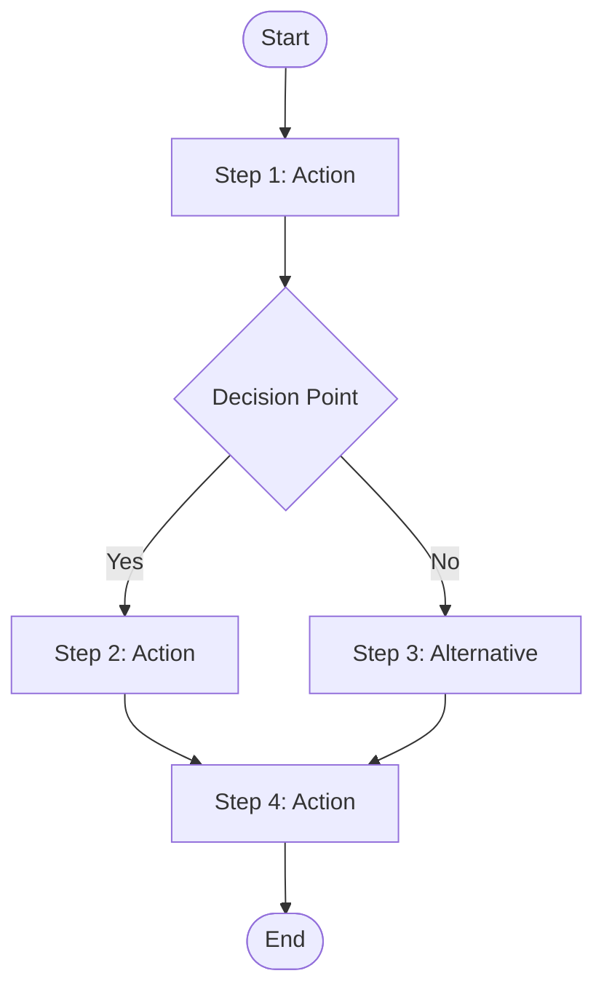
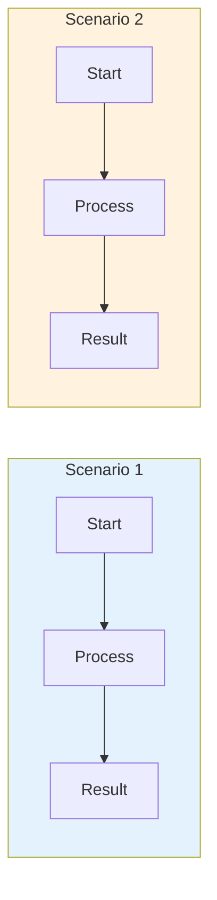

# Requirements Analysis Template

> **Perspective**: Product | **Audience**: PM, Business, Tech Lead
>
> This document describes business requirements, **without code or implementation details**.

## 1. Background and Status Quo

### 1.1 Business Background
Describe business scenario and requirement source

### 1.2 Current Analysis
Describe current system problems or limitations

### 1.3 Core Pain Points
- Pain point 1
- Pain point 2
- Pain point 3

---

## 2. Objectives

Describe goals to be achieved through this change

### 2.1 Main Objectives
- Objective 1
- Objective 2

### 2.2 Success Criteria
- Criteria 1
- Criteria 2

---

## 3. Business Scenarios

### 3.1 Scenario 1: {Scenario Name}
**Description**: Describe specific business scenario

**User Story**:
> As {role}, I want {feature}, so that {value}

**Preconditions**:
- Condition 1
- Condition 2

**Operation Flow**:

**Expected Results**:
- Result 1
- Result 2

### 3.2 Scenario 2: {Scenario Name}
(Same structure)

### 3.3 Overall Business Flow

---

## 4. Functional Requirements

### 4.1 Requirement 1: {Requirement Name}

**Description**:
Describe business meaning

**Acceptance Criteria**:
| ID | Description | Priority |
|----|-------------|----------|
| AC-01 | Criteria description | P0 |
| AC-02 | Criteria description | P1 |

**Data Input**:
| Field | Type | Description | Required |
|-------|------|-------------|----------|
| field1 | string | Field description | Yes |
| field2 | array | Field description | No |

**Data Output**:
| Field | Type | Description |
|-------|------|-------------|
| field1 | string | Field description |
| field2 | object | Field description |

### 4.2 Requirement 2: {Requirement Name}
(Same structure)

---

## 5. Compatibility Requirements

### 5.1 Backward Compatibility
Describe impact on existing functionality

### 5.2 Upgrade Path
Describe upgrade path from old to new version

---

## 6. Non-Functional Requirements

### 6.1 Performance Requirements
- Performance metric 1
- Performance metric 2

### 6.2 Security Requirements
- Security requirement 1
- Security requirement 2

### 6.3 Availability Requirements
- Availability requirement 1
- Availability requirement 2

---

## 7. Acceptance Criteria

| Scenario | Acceptance Condition | Verification Method |
|----------|--------------------|--------------------|
| Scenario 1 | Condition description | Verification method |
| Scenario 2 | Condition description | Verification method |

---

## 8. Glossary

| Term | Definition |
|------|------------|
| Term1 | Term definition |
| Term2 | Term definition |

---

## 9. References

- [Design Specification](./{feature-name}-design-specification.md)
- [Implementation Plan](./{feature-name}-implementation-plan.md)
