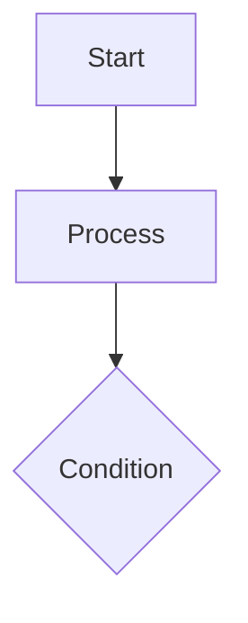

# Technical Documentation Generator

Generate complete technical documentation based on user input. **Automatically detect user's language and generate documents accordingly. No confirmation needed.**

## Document Types

| Document | Perspective | Audience | Key Features |
|----------|-------------|----------|--------------|
| Requirements Analysis | Product | PM, Business | No code/pseudocode |
| Design Specification | Technical | Engineers, Architects | Includes pseudocode + Mermaid |
| Implementation Plan | Implementation | Engineers | Steps, checklists, rollback |

## Language Detection

**Automatically detect user's preferred language from conversation context:**
- If conversation is in Chinese → Generate Chinese documents
- If conversation is in English → Generate English documents
- No confirmation needed, proceed directly

## Workflow

### Step 1: Collect Requirements (Minimal Interaction)

Quickly clarify core info:
1. **Feature Name**: Name of the feature
2. **Brief Description**: What it does
3. **Key Scenarios**: Main use cases

### Step 2: Generate All Documents

Generate in order:
1. **Requirements Analysis** (Product Perspective)
2. **Design Specification** (Technical Perspective)
3. **Implementation Plan** (Implementation Perspective)

## Output Location

Default: `docs/feature/{feature-name}/`

## Diagram Standards

> **Important**: All diagrams **must use Mermaid syntax**

## Quality Checklist

- [ ] Requirements: No code/pseudocode
- [ ] Design: No PR numbers or repo paths
- [ ] All diagrams use Mermaid
- [ ] Structure matches template

## Templates

- [requirements-analysis-template.md](./templates/requirements-analysis-template.md)
- [design-specification-template.md](./templates/design-specification-template.md)
- [implementation-plan-template.md](./templates/implementation-plan-template.md)
