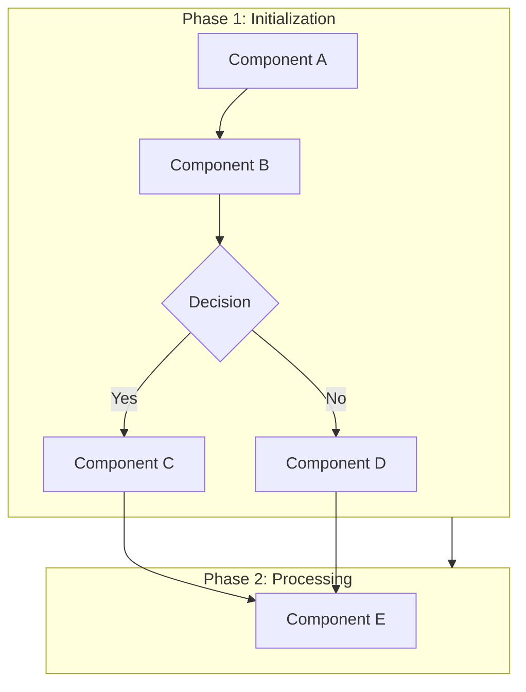
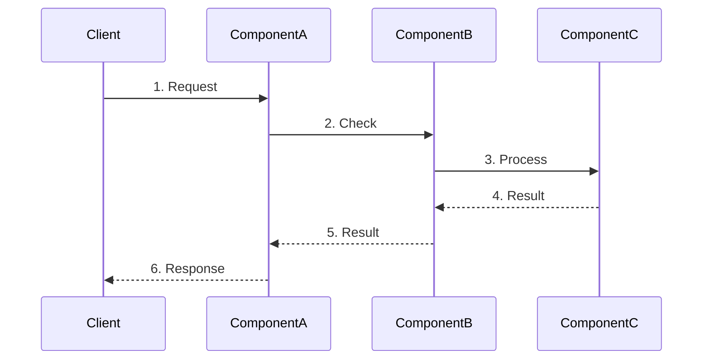

# {Feature Name} - Design Specification

> **Perspective**: Technical | **Audience**: Engineers, Architects
>
> This document describes technical implementation, **includes pseudocode and Mermaid diagrams**.

---

## 1. Overview

Brief description of the design

---

## 2. Architecture

### 2.1 Architecture Diagram



### 2.2 Component Responsibilities

| Component | Responsibility |
|-----------|----------------|
| Component A | Description |
| Component B | Description |
| Component C | Description |

### 2.3 Method Signatures

| Method | Signature | Description |
|--------|-----------|-------------|
| Method1 | `func (c *ComponentA) Method1(param string) error` | Description |
| Method2 | `func (c *ComponentA) Method2() (Result, error)` | Description |

---

## 3. Detailed Design

### 3.1 Component A Design

#### 3.1.1 Core Algorithm Pseudocode

```pseudocode
// Algorithm Name
// Description

FUNCTION ProcessData(input):
    result ← empty map
    
    FOR each item IN input:
        IF item.condition = TRUE THEN:
            result[item.key] ← transform(item.value)
        ELSE:
            result[item.key] ← default_value
        END IF
    END FOR
    
    RETURN result
```

#### 3.1.2 Sequence Diagram



---

## 4. Data Structures

### 4.1 Configuration

| Config | Type | Default | Description |
|--------|------|---------|-------------|
| config1 | string | "" | Description |
| config2 | int | 0 | Description |
| config3 | bool | false | Description |

### 4.2 Example

```yaml
feature:
  enabled: true
  option1: value1
```

---

## 5. Key Design Decisions

### 5.1 Decision 1: {Decision Name}

**Problem**: Describe the design challenge

**Options**:
- Option A: Description + pros/cons
- Option B: Description + pros/cons

**Decision**: Choose {Option X}

**Reasons**:
- Reason 1
- Reason 2

---

## 6. Compatibility

### 6.1 Backward Compatibility
Describe how to maintain compatibility

### 6.2 Data Migration
Describe migration plan if needed

---

## 7. Risk Assessment

| Risk | Impact | Mitigation |
|------|--------|------------|
| Risk 1 | Description | Mitigation |
| Risk 2 | Description | Mitigation |

---

## 8. Testing

### 8.1 Unit Tests
Describe unit test strategy

### 8.2 Integration Tests
Describe integration test strategy

### 8.3 Test Cases

| Case | Input | Expected Output |
|------|-------|----------------|
| Case 1 | Description | Output |
| Case 2 | Description | Output |

---

## 9. References

- [Requirements Analysis](./{feature-name}-requirements.md)
- [Implementation Plan](./{feature-name}-implementation.md)
